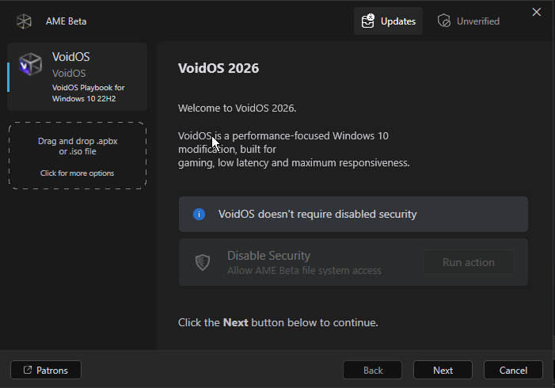
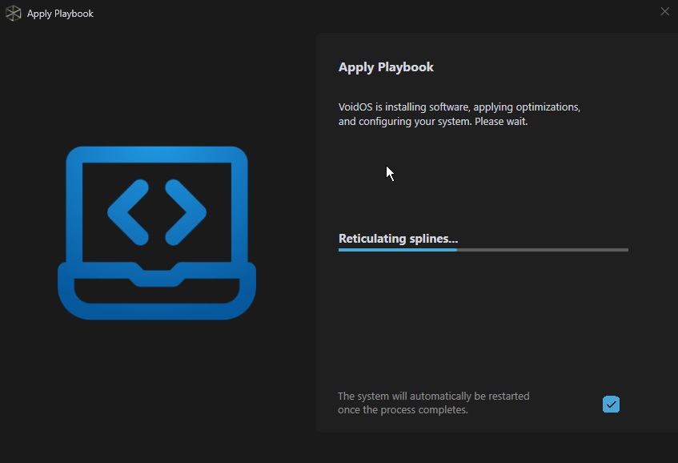
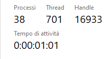

<h1 align="center">
   
  VoidOS Playbook
</h1>

<p align="center">
  
  
  
</p>

<p align="center"><strong>VoidOS Playbook</strong> is a pre-configured AME Wizard playbook that transforms Windows&nbsp;10 into a lean, fast and responsive operating system — focused on <strong>gaming performance</strong> and <strong>productivity</strong>, with zero manual tuning required.</p>

---

## What is it?

Instead of hunting through dozens of tutorials, registry edits and third-party tools, the playbook bundles everything into a **single automated pass**. It installs into **AME Wizard** and handles the whole process for you: it cleans, tweaks, customizes and optimizes your system from start to finish.

> Think of it as a **recipe for your system**: proven configurations applied automatically so you get the most out of your hardware.

## ✨ Features

- 🚀 **Performance Optimization** — system settings tuned for speed and responsiveness.
- 🎮 **Gaming Enhancements** — higher FPS, lower latency, cleaner resource usage.
- 🧹 **Automated Debloating** — removes bloatware, unused AppX packages, Cortana leftovers and more.
- 🎨 **Full Customization** — VoidOS theme, macOS-inspired cursors, wallpaper and taskbar branding.
- 🧩 **Reliable Uninstallers** — proper removal of Microsoft Edge, OneDrive and Teams.
- ⚡ **Advanced Tweaks** — power plan, services, registry, kernel, search and start-menu optimizations.
- 🛡️ **Safe & Reversible** — every task is grouped and optional, focused on safe, non-destructive changes.

## 📸 Screenshots

| Installation | Applying playbook | Result |
|:---:|:---:|:---:|
|  |  |  |

## 🚀 Getting started

1. Download the latest **`.apbx`** release from the [Releases](https://github.com/VoidOSorg/playbook/releases) page.
2. Open **AME Wizard** → **Playbook** → load the playbook package.
3. Choose your preferred options in the wizard and press **Start**.
4. Let the playbook run — no manual steps needed.

## 📁 Repository layout

```
Configuration/      → playbook tasks (YAML) + order definition
Executables/        → scripts, modules and assets used by the playbook
Resources/          → themes, wallpapers, cursors and VoidOS-Tweaks toolbox
Screenshots/        → preview images for the README
playbook.conf       → AME Wizard playbook configuration (UI pages)
```

## 🤝 Contributing

Contributions are welcome! If you have new tweaks, improvements, or suggestions, feel free to submit a pull request or open an issue.

## 📜 License

Distributed under the **MIT License**. See `LICENSE` for more information.